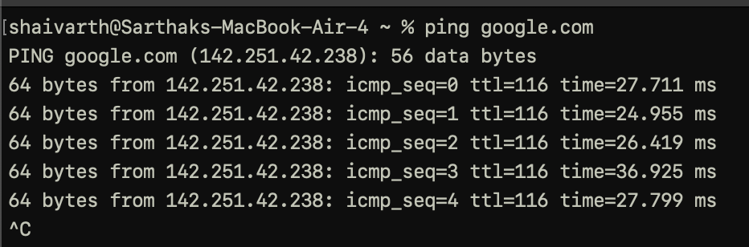
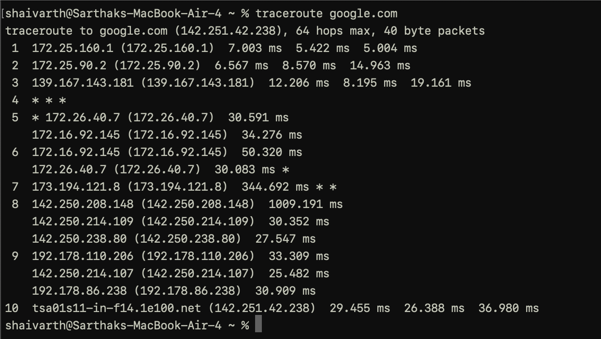

# Introductory Networking
  Room: Introductory Networking 
  Difficulty: Easy 
  Category: Network 
  Date Started: 14-08-2025 
  Link: https://tryhackme.com/room/introtonetworking

# Purpose 
  I’ve learned networking before, but this room was suggested in a Medium article, so I decided to try it too. 
  Here's the link to the article : https://medium.com/@polygonben/ejpt-a-guide-on-how-to-pass-first-time-f8cec3f79a73 

# Key Learnings 
  Learned about OSI and TCP/IP Models, Process of encapsulation and De-encapsulation, How three-way handshake works, 
  and also learned about some basic tools like : ping, traceroute, WHOIS, Dig. 

# Tools 
  * ping : The ping command is used when we want to test whether a connection to a remote resource is possible. 
  
    
    
  * traceroute : Traceroute can be used to map the path your request takes as it heads to the target machine. 

    
                                                                        
  
